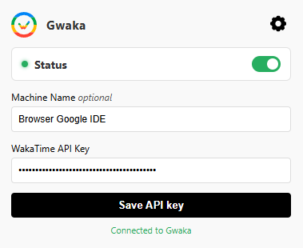

# Gwaka



> Track time across Google Workspace with Gwaka.


---

## What is this?

[**Gwaka**](https://gwaka.vercel.app/) is a Chrome extension that automatically tracks the time you spend working across Google Workspace and reports it directly to your [WakaTime](https://wakatime.com) dashboard — just like any other editor plugin would.

Once installed, it runs silently in the background. Every time you work in a supported Google app, a heartbeat is sent to WakaTime and your time gets logged under the matching editor, language, and project.

---

## How it started

Gwaka started as a simple idea: WakaTime tracks time in every major editor, but there was nothing for Google Apps Script — a place where a lot of real coding happens. So the first version was just that: a file tracker for the Apps Script IDE.

Once that worked, it became obvious that the same approach applied to the rest of Google Workspace. Docs, Sheets, Slides, Colab — people spend real working hours in all of them, and none of it showed up in WakaTime. Gwaka grew to cover the whole workspace, one environment at a time.

---

## Supported Environments

| Environment | Domain | Category |
|---|---|---|
| Google Apps Script | `script.google.com` | coding |
| Google Docs | `docs.google.com/document` | writing docs |
| Google Sheets | `docs.google.com/spreadsheets` | coding |
| Google Slides | `docs.google.com/presentation` | designing |
| Google Forms | `docs.google.com/forms` | coding |
| Google Drive | `drive.google.com` | browsing |
| Google Colab | `colab.research.google.com` | coding (Python) |
| Google Sites | `sites.google.com` | designing |

You can enable or disable each environment individually from the extension settings.

---

## Features

- ⏱ Automatic time tracking across Google Workspace
- 📁 Per-project tracking — each document or script shows up as its own project
- 🌐 Per-environment toggle — choose exactly which Google apps to track
- ⏸ Pause/resume tracking instantly from the popup
- 🖥 Configurable machine name
- 🔑 Simple API key setup — no CLI or config files needed

---

## Installation

1. Go to the Chrome Web Store listing *([chrome web store](https://chromewebstore.google.com/detail/wakatime-for-google-apps/gmpiofbkheibmaofamolbnahecgafkje?authuser=0&hl=en))*
2. Click **Add to Chrome**
3. Click the extension icon in your toolbar
4. Enter your [WakaTime API key](https://wakatime.com/settings/api-key)
5. Optionally set a custom machine name (defaults to `Browser Google IDE`)
6. Click **Save** — you're done!

### Local Install

1. Clone or download this repository
   ```bash
   git clone https://github.com/Koppeks/gwaka
   ```
2. Open Chrome and go to `chrome://extensions`
3. Enable **Developer mode** (top right toggle)
4. Click **Load unpacked** and select the project folder
5. Click the extension icon and enter your WakaTime API key into Gwaka

---

## How It Works

Gwaka injects a content script into each supported Google domain. It listens for keyboard activity and sends a **heartbeat** directly to the [WakaTime API](https://wakatime.com/developers#heartbeats) via `fetch` — no native client needed.

```
User types in a supported Google app
        ↓
Content script detects activity
        ↓
Heartbeat sent to WakaTime API
  - entity: current file / document title
  - project: document or script name
  - language: per-environment (e.g. Python for Colab)
  - category: per-environment (e.g. designing for Slides)
  - X-Machine-Name: your configured machine name
        ↓
Time appears in WakaTime dashboard
```

### Key technical details

- **No wakatime-cli needed** — heartbeats go directly from the browser via the REST API
- **Heartbeat throttling** — one heartbeat per environment every 2 minutes, following the [official WakaTime plugin spec](https://wakatime.com/help/creating-plugin)
- **Per-environment tracking** — each Google app has its own heartbeat timer and can be toggled independently
- **API key** is stored in `chrome.storage.sync` and syncs across Chrome sign-ins

---

## Configuration

Click the extension icon to open the popup:

| Setting | Description | Default |
|---|---|---|
| **Status toggle** | Pause or resume all tracking instantly | enabled |
| **API Key** | Your WakaTime API key | *(required)* |
| **Machine Name** | How this browser shows up in your WakaTime dashboard | `Browser Google IDE` |

Click the settings icon on the top right (⚙) to choose which Google environments to track.

---

## Project Structure

```
/
├── manifest.json       # Chrome extension manifest (MV3)
├── content.js          # Injected into Google domains, sends heartbeats
├── operatingSystems.js # OS detection from navigator.userAgent
├── popup.html          # Extension popup UI
└── popup.js            # Popup logic (API key, machine name, env toggles)
```

---

## Contributing

This project is still in early development and actively evolving. Expect changes, and feel free to contribute.
*PRs are welcome.*

### Getting started

1. Fork the repository
2. Clone your fork
   ```bash
   git clone https://github.com/Koppeks/gwaka.git
   ```
3. Load it unpacked in Chrome (see [local install](#for-now-local-install) above)
4. Make your changes and test them in any supported Google app
5. Open a pull request against `master`

### Reporting issues

Open an issue on [GitHub Issues](https://github.com/Koppeks/gwaka/issues) with:
- What you expected to happen
- What actually happened
- Your Chrome version and OS

---

### 📂 Related Repositories
Check out the [Gwaka SPA](https://github.com/Koppeks/gwaka-spa) - The single page application that showcases the extension.

## Acknowledgements

- [WakaTime](https://wakatime.com) for their open API and plugin documentation

---

> Made by [@Koppeks](https://github.com/Koppeks) — PRs welcome!
